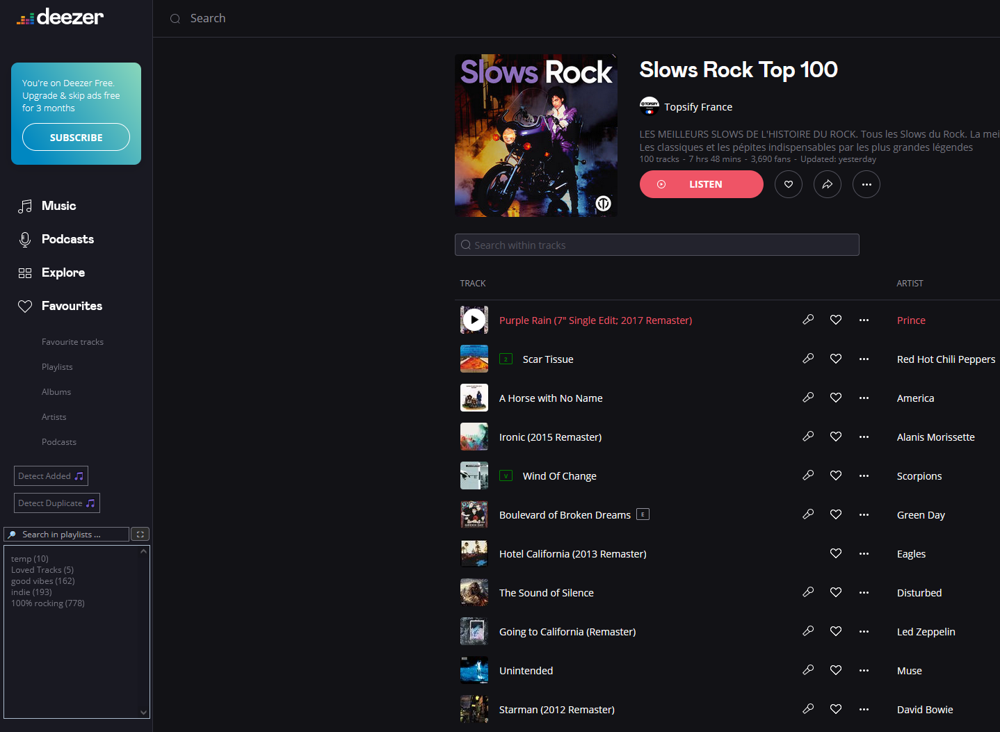
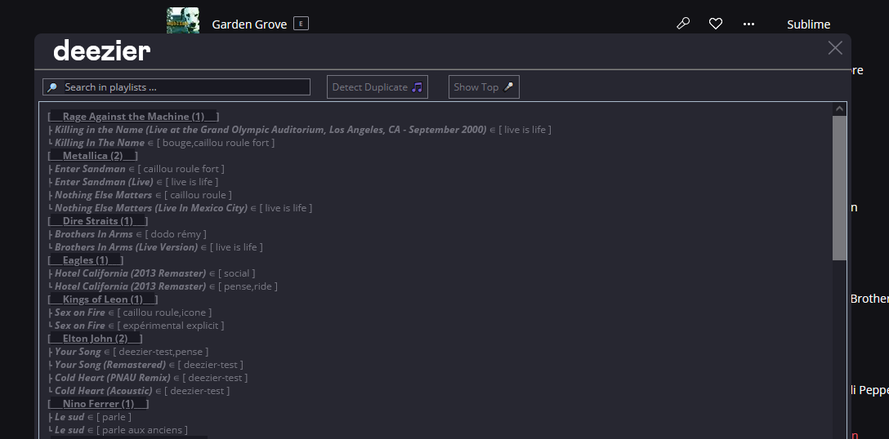

# Deezier
A native-JS userscript enhancing your experience listening music on Deezer with new useful features.

## Current features

Deezier injects itself in the Deezer sidebar at the webpage loading. This center of command allows you to use all the features of Deezier :

 
The results of researches/actions are summarized in the tight area injected. For convenience and access to more advanced features, this can be expanded into a popup using the button beside the sidebar :   

__List of supported features__ :
- Listing of your *personal playlists* directly accessible from your sidebar
- Instant research walking through all your playlists, matching *artist names* and *track titles*
- In-page detection of *tracks already present* in any of your playlists, marked with a little green icon beside (see screenshots above)
- Detection of *duplicated tracks* of the same artists ("Everlong" and "Everlong (acoustic)" in the same playlist are likely an error)
- Compiling a *top list of all artists* listenable in your playlists, even the ones you didn't put in your favorites

*NOTE* : Deezier doesn't work on a dynamic way, meaning that if you add a track to a playlist, don't expect it to show up in the Deezier library until you do a refresh of the page.

*NOTE 2* : it can happen that a track in your playlists doesn't get detected as in because Deezer API return inconsitencies. A patch will be done if they don't repair it. 

## Installation

Install an user-script manager like [Greasemokey](https://addons.mozilla.org/fr/firefox/addon/greasemonkey/) and [Violentmonkey](https://violentmonkey.github.io/get-it/) and simply load in the [script](./deezier.js). Deezier is JS-native and doesn't need any dependency.

🎵 Enjoy ! 🎵

----

TODO:
- Caching using local storage
- Feature : add songs to 'next to play' or in a customized user's playlist
- Feature : play all new songs in notifications
- Refresh library button
- 'Add to playlist' button in player view
